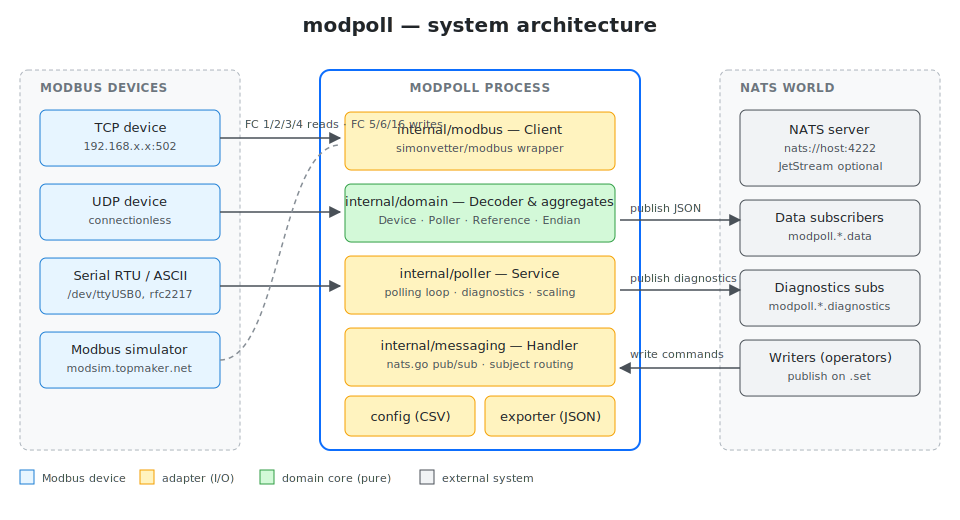
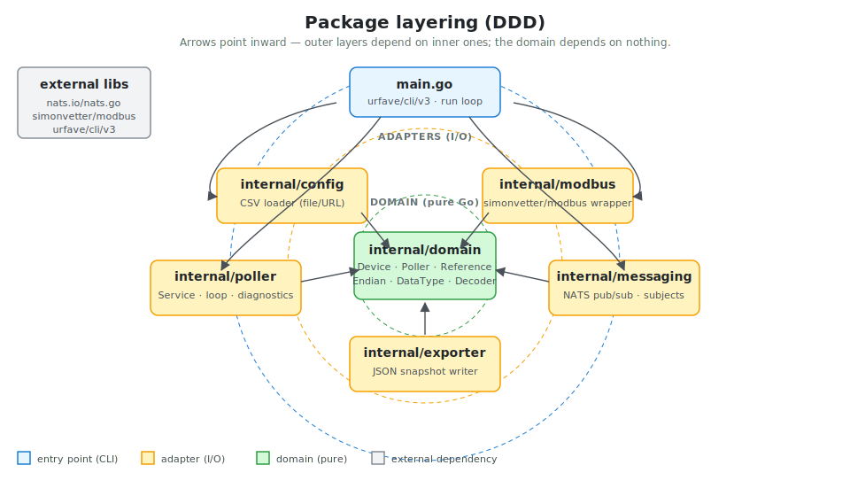
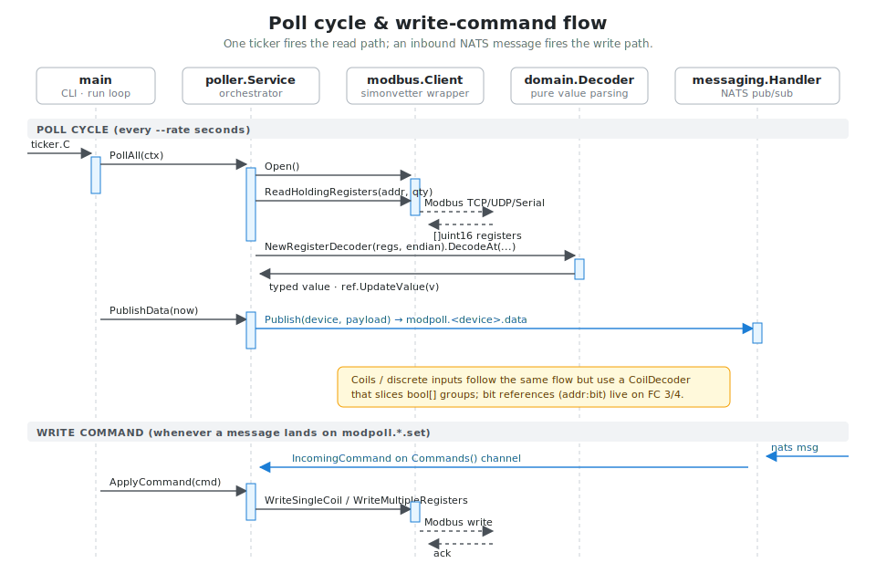

# modpoll (Go)

A Go rewrite of [gavinying/modpoll](https://github.com/gavinying/modpoll). The
tool polls Modbus TCP/UDP/RTU/ASCII devices and forwards the decoded data over
[NATS](https://nats.io) subjects (the original tool used MQTT topics).

## Architecture

| Diagram | What it shows |
| ------- | ------------- |
|  | Modbus devices on the left, the modpoll process in the middle, NATS and consumers on the right. |
|  | DDD layering: `domain` is pure Go and depends on nothing; adapters wrap I/O; `main.go` is the entry point. |
|  | One poll cycle plus an inbound write-command, as a sequence across the lanes. |

## Features

- Modbus master over TCP, UDP, RTU and ASCII (framer auto-selected per
  transport).
- CSV-driven device, poller and reference configuration — loaded from a local
  file or HTTP(S) URL.
- Endian-aware decoder for `uint16/int16/uint32/int32/uint64/int64/float32/float64`,
  `bool/bool8/bool16` and fixed-width `stringNN`. Bit references (`addr:bit`)
  on holding/input registers are supported.
- Publishes JSON payloads on per-device NATS subjects. Subscribes to a
  wildcard subject for write commands.
- Optional local JSON export, periodic diagnostics, daemon mode for headless
  use.

## Build

```bash
cd new/
go build -o modpoll .
```

`go test ./...` runs the unit tests for decoding, the CSV loader, and the
subject helpers.

## CLI reference

`modpoll --help` lists every flag. The table below groups them by purpose.

### General

| Flag                         | Default  | Description                                             |
| ---------------------------- | -------- | ------------------------------------------------------- |
| `--config, -f` *(required)*  | —        | Path or URL of the Modbus CSV config. Repeat for many.  |
| `--once, -1`                 | `false`  | Run a single poll cycle and exit.                       |
| `--daemon, -d`               | `false`  | Suppress the per-cycle result table.                    |
| `--rate, -r`                 | `10.0`   | Sampling rate in seconds.                               |
| `--interval`                 | `0.5`    | Pause (seconds) between two pollers in the same cycle.  |
| `--delay`                    | `0`      | Seconds to wait before the first poll.                  |
| `--export, -o`               | —        | Write decoded data to this JSON file each cycle.        |
| `--timestamp`                | `false`  | Add an RFC3339 timestamp to every payload/export row.   |
| `--diagnostics-rate`         | `0`      | Seconds between diagnostics publishes (0 disables).     |
| `--autoremove`               | `false`  | Disable a poller after 3 consecutive failures.          |
| `--loglevel`                 | `INFO`   | `DEBUG`, `INFO`, `WARN` or `ERROR`.                     |

### Modbus transport

Exactly one of `--tcp`, `--udp`, `--serial` (alias `--rtu`) is required.

| Flag                                          | Default  | Description                                  |
| --------------------------------------------- | -------- | -------------------------------------------- |
| `--tcp <host>`                                | —        | Modbus TCP host.                             |
| `--tcp-port`                                  | `502`    | Modbus TCP port.                             |
| `--udp <host>`                                | —        | Modbus UDP host.                             |
| `--udp-port`                                  | `502`    | Modbus UDP port.                             |
| `--serial <port>` (alias `--rtu`)             | —        | Serial device (e.g. `/dev/ttyUSB0`) or URL.  |
| `--serial-baud` (alias `--rtu-baud`)          | `9600`   | Serial baud rate.                            |
| `--serial-parity` (alias `--rtu-parity`)      | `none`   | `none`, `odd` or `even`.                     |
| `--timeout`                                   | `3.0`    | Modbus response timeout (seconds).           |
| `--framer`                                    | `default`| `default`, `ascii`, `rtu` or `socket`. Validated against the transport. |

### NATS

`--nats-url` is the master switch — if it is left empty modpoll runs locally
(prints/exports only). The URL can also be supplied via the `NATS_URL`
environment variable.

| Flag                                       | Default                            | Description                                              |
| ------------------------------------------ | ---------------------------------- | -------------------------------------------------------- |
| `--nats-url`                               | — (env `NATS_URL`)                 | NATS connection URL.                                     |
| `--nats-name`                              | `modpoll`                          | Client name reported to the server.                      |
| `--nats-user`                              | —                                  | Username.                                                |
| `--nats-pass`                              | —                                  | Password.                                                |
| `--nats-token`                             | —                                  | Auth token.                                              |
| `--nats-creds`                             | —                                  | Path to a NATS credentials file.                         |
| `--nats-tls`                               | `false`                            | Connect over TLS.                                        |
| `--nats-publish-subject-pattern`           | `modpoll.{device}.data`            | `{device}` is replaced with each device name.            |
| `--nats-subscribe-subject-pattern`         | `modpoll.*.set`                    | NATS wildcard; the `*` token is read as the device name. |
| `--nats-diagnostics-subject-pattern`       | `modpoll.{device}.diagnostics`     | Diagnostics subject pattern.                             |
| `--nats-single`                            | `false`                            | Publish each reference on its own subject.               |

## NATS subjects

Default mapping (all configurable via CLI flags):

| Direction | Subject pattern                            |
| --------- | ------------------------------------------ |
| publish   | `modpoll.<device>.data`                    |
| publish   | `modpoll.<device>.diagnostics`             |
| subscribe | `modpoll.*.set` (wildcard = device name)   |

When `--nats-single` is set, each reference is published on its own subject:

```
modpoll.<device>.data.<reference_name>
```

### Write commands

Publish a JSON message on the subscribe subject to write a Modbus value:

```bash
# Single holding register
nats pub 'modpoll.modsim01.set' \
  '{"object_type":"holding_register","address":40001,"value":12}'

# Multiple holding registers starting at 40001
nats pub 'modpoll.modsim01.set' \
  '{"object_type":"holding_register","address":40001,"value":[12,13,14,15]}'

# Single coil
nats pub 'modpoll.modsim01.set' \
  '{"object_type":"coil","address":0,"value":true}'
```

Supported `object_type` values: `coil`, `holding_register`.

## CSV configuration

Each row is one of `device`, `poll` or `ref`. Lines starting with `#` and
blank lines are ignored.

```csv
# device,<name>,<unit_id>
# poll,<object_type>,<start_address>,<size>,<endian>
# ref,<name>,<address>,<dtype>,<rw>,<unit>,<scale>

device,modsim01,1,,
poll,coil,0,16,BE_BE
ref,coil01-08,0,bool8,rw
ref,coil09-16,1,bool8,rw
poll,holding_register,40000,44,BE_BE
ref,holding_reg01,40000,uint16,rw
ref,holding_reg10,40010,uint32,rw,,0.001
ref,holding_reg13,40016,float32,rw
ref,holding_reg19,40036,string16,rw
ref,alarm_bit_15,40019:15,bool,r,
```

Field reference:

- `<object_type>`: `coil`, `discrete_input`, `holding_register`, `input_register`.
- `<endian>`: `BE_BE` (default), `LE_BE`, `LE_LE`, `BE_LE` —
  *<byte_order>_<word_order>*.
- `<dtype>`: `uint16`, `int16`, `uint32`, `int32`, `uint64`, `int64`,
  `float32`, `float64`, `bool`, `bool8`, `bool16`, `stringN` (N = byte length).
- `<rw>`: `r`, `w` or `rw`. Anything containing `r` is polled.
- `<unit>` *(optional)*: free-form text included as `name|unit` in publishes.
- `<scale>` *(optional)*: float multiplier applied to numeric values.
- `<address>:bit` syntax: extract a single bit from a holding/input register.
  Only valid with `dtype=bool` (bit index 0..15, LSB-first).

See `examples/modsim.csv` and `examples/config_template.csv` for full samples.

## Examples

### Smallest possible run

```bash
./modpoll --once --tcp 127.0.0.1 --tcp-port 5020 \
  --config examples/modsim.csv
```

### Continuous polling

```bash
./modpoll --tcp modsim.topmaker.net \
  --rate 5 \
  --config examples/modsim.csv
```

### Poll a Modbus TCP device on a non-standard port

```bash
./modpoll --tcp 192.168.1.10 --tcp-port 1502 \
  --config examples/modsim.csv
```

### Poll a Modbus UDP device

```bash
./modpoll --udp 192.168.1.10 --udp-port 502 \
  --config examples/modsim.csv
```

### Poll a serial RTU device

```bash
./modpoll --serial /dev/ttyUSB0 \
  --serial-baud 19200 --serial-parity even \
  --config examples/modsim.csv
```

### Poll a serial ASCII device (explicit framer)

```bash
./modpoll --serial /dev/ttyUSB0 --framer ascii \
  --serial-baud 9600 \
  --config examples/modsim.csv
```

### Serial-over-TCP tunnel (rfc2217 / socket URL)

```bash
./modpoll --serial 'socket://gateway.local:7000' --framer rtu \
  --config examples/modsim.csv
```

### Publish to a local NATS server

```bash
./modpoll --tcp modsim.topmaker.net \
  --config examples/modsim.csv \
  --nats-url nats://127.0.0.1:4222

# In another terminal:
nats sub 'modpoll.*.data'
```

### Publish with custom subject patterns

```bash
./modpoll --tcp modsim.topmaker.net \
  --config examples/modsim.csv \
  --nats-url nats://127.0.0.1:4222 \
  --nats-publish-subject-pattern 'site.factory1.{device}.tlm' \
  --nats-diagnostics-subject-pattern 'site.factory1.{device}.health' \
  --nats-subscribe-subject-pattern 'site.factory1.*.write'
```

### Publish each reference on its own subject

```bash
./modpoll --tcp modsim.topmaker.net \
  --config examples/modsim.csv \
  --nats-url nats://127.0.0.1:4222 \
  --nats-single

# Each reference lands on:  modpoll.<device>.data.<reference_name>
nats sub 'modpoll.modsim01.data.>'
```

### Authenticated NATS connections

```bash
# User/password
./modpoll --nats-url nats://broker.example.com:4222 \
  --nats-user alice --nats-pass s3cret \
  --tcp 192.168.1.10 --config examples/modsim.csv

# Token
./modpoll --nats-url nats://broker.example.com:4222 \
  --nats-token mY-T0Ken \
  --tcp 192.168.1.10 --config examples/modsim.csv

# NATS credentials file (operator/JWT)
./modpoll --nats-url tls://connect.ngs.global:4222 \
  --nats-creds /etc/modpoll/nats.creds \
  --tcp 192.168.1.10 --config examples/modsim.csv
```

### Use TLS

```bash
./modpoll --nats-url tls://broker.example.com:4222 --nats-tls \
  --tcp 192.168.1.10 --config examples/modsim.csv
```

### Add timestamps to every payload

```bash
./modpoll --tcp modsim.topmaker.net \
  --config examples/modsim.csv \
  --nats-url nats://127.0.0.1:4222 \
  --timestamp
```

### Periodic diagnostics

```bash
./modpoll --tcp modsim.topmaker.net \
  --config examples/modsim.csv \
  --nats-url nats://127.0.0.1:4222 \
  --diagnostics-rate 60

nats sub 'modpoll.*.diagnostics'
```

Diagnostics payload:

```json
{ "poll_count": 42, "error_count": 0, "last_poll_success": true }
```

### Auto-disable broken pollers

```bash
./modpoll --tcp 192.168.1.10 \
  --config examples/modsim.csv \
  --autoremove
```

Any poller that fails three cycles in a row is marked disabled for the rest
of the process lifetime.

### Daemon mode (no console table)

```bash
./modpoll -d \
  --tcp modsim.topmaker.net \
  --config examples/modsim.csv \
  --nats-url nats://127.0.0.1:4222
```

### Export decoded data to a JSON file

```bash
./modpoll --tcp modsim.topmaker.net \
  --export data.json \
  --config examples/modsim.csv
```

### Load multiple config files / multiple devices

```bash
./modpoll --tcp modsim.topmaker.net \
  --config examples/modsim.csv \
  --config examples/modsim2.csv
```

### Load a config from a URL

```bash
./modpoll --tcp modsim.topmaker.net \
  --config https://raw.githubusercontent.com/gavinying/modpoll/main/examples/modsim.csv
```

### Increase Modbus timeout / slow link

```bash
./modpoll --tcp slow.gateway.local --timeout 10 \
  --interval 1.5 \
  --config examples/modsim.csv
```

### Verbose logging

```bash
./modpoll --loglevel DEBUG \
  --tcp modsim.topmaker.net \
  --config examples/modsim.csv
```

### Write a value via NATS

```bash
# In one terminal, run modpoll connected to NATS
./modpoll --tcp 192.168.1.10 \
  --config examples/modsim.csv \
  --nats-url nats://127.0.0.1:4222

# In another terminal, send a write command
nats pub 'modpoll.modsim01.set' \
  '{"object_type":"holding_register","address":40001,"value":42}'
```

## Docker

A multi-stage `Dockerfile` (distroless static, non-root) lives at the project
root.

```bash
# Build locally
docker build -t modpoll:dev .

# Run once against a public test device
docker run --rm modpoll:dev --once \
  --tcp modsim.topmaker.net \
  --config https://raw.githubusercontent.com/gavinying/modpoll/main/examples/modsim.csv
```

Published images: a GitHub Actions workflow (`.github/workflows/docker.yml`)
publishes multi-arch (`linux/amd64`, `linux/arm64`) images to GitHub Container
Registry **only when a `vX.Y.Z` git tag is pushed**. Each release is tagged
with `:latest`, `:X.Y.Z`, `:X.Y` and `:X`:

```bash
# Release flow
git tag v0.2.0
git push origin v0.2.0

# After the workflow finishes:
docker pull ghcr.io/<org>/modpoll:latest
docker pull ghcr.io/<org>/modpoll:0.2.0
```

Pre-release tags (e.g. `v0.2.0-rc1`) build the image but do not move the
`:latest` tag.

## Project layout

The package layout follows a small Domain-Driven layout:

```
new/
├── main.go                      CLI entry point (urfave/cli/v3)
├── examples/                    Sample CSV configs
└── internal/
    ├── domain/                  Pure value objects + decoders (no I/O)
    ├── config/                  CSV loader (local file or HTTP URL)
    ├── modbus/                  Modbus master facade
    ├── messaging/               NATS publisher / write-command subscriber
    ├── poller/                  Polling service + result printer
    └── exporter/                JSON file exporter
```

## Tests

```bash
go test ./...
```

The unit tests focus on the decoding behaviour (endianness, bit extraction,
strings, scale), the CSV loader, and the NATS subject helpers.
